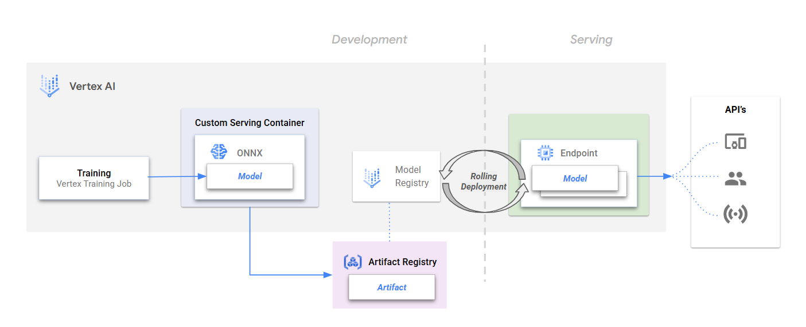

# rolling-deployment

This project demonstrates building custom serving containers for Vertex AI and performing rolling deployments to replace deployed models with zero downtime.

## Getting started

Once the prerequisites have been met and the user parameters are specified, users can follow the notebooks to run through the guided steps.

### Notebooks

* [01-custom-container-deployment.ipynb](./01-custom-container-deployment.ipynb) : This notebook trains an MNIST model that is converted to ONNX format. The model is packaged in a custom FastAPI serving container, registered with Vertex AI, and deployed to an endpoint.

* [02-rolling-deployment.ipynb](./02-rolling-deployment.ipynb) : This notebook demonstrates how to perform a rolling deployment to replace an existing deployed model on an endpoint with minimal downtime, using configurable surge and unavailability parameters

### Prerequisites

Ensure the project environment, network settings, and service accounts used have the appropriate Google Cloud authentication and permissions to access the following services:
- `Vertex AI`
- `Cloud Storage`
- `Artifact Registry`
